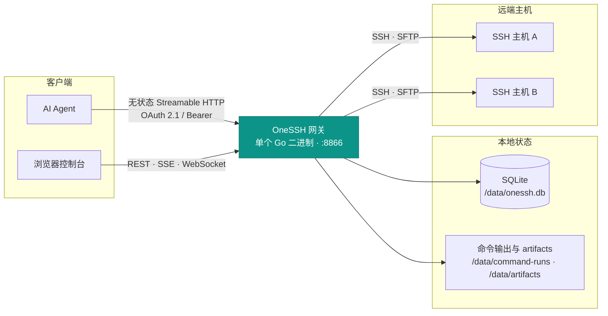
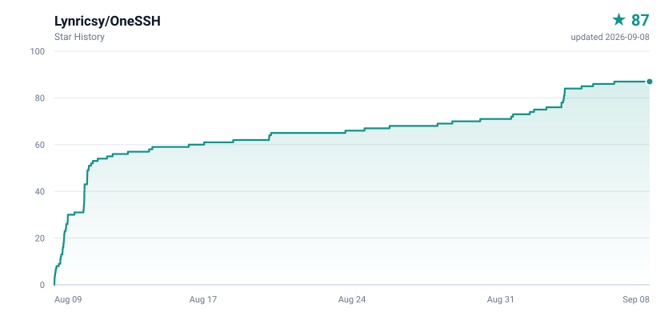

<div align="center">


# OneSSH

**面向 AI Agent 的集中式 SSH 网关**

一个 Go 二进制，同时提供无状态 Streamable HTTP MCP、OAuth 2.1 授权、管理 API、实时活动流和浏览器终端。

[](https://github.com/Lynricsy/OneSSH/actions/workflows/ci.yml)
[](https://github.com/Lynricsy/OneSSH/releases/latest)
[](LICENSE)
[](go.mod)
[](https://github.com/Lynricsy/OneSSH)

[](https://github.com/Lynricsy/OneSSH/commits/main)
[](https://github.com/Lynricsy/OneSSH/pulse)
[](https://github.com/Lynricsy/OneSSH/issues)
[](https://github.com/Lynricsy/OneSSH/stargazers)

[](https://github.com/Lynricsy/OneSSH/pkgs/container/onessh)
[](#mcp-接入)
[](#两种凭据)
[](#本地开发)
[](#持续集成与镜像)
[](#本地开发)

</div>

---

## 为什么需要它

让 Agent 直接持有 SSH 私钥，安全性并非无解——`authorized_keys` 的 `command=`、`from=`、`restrict`、`permitopen=`，以及 CA 证书的有效期和 principals，都能实打实地收窄一把钥匙。真正的问题是这些控制点**分散在每一台主机上**：调整一次授权要遍历所有机器，撤销同理；而 sshd 的日志只到会话粒度，看不出 Agent 究竟读写了哪些文件。OneSSH 把这些控制点收敛到网关一侧：

- **凭据不出网关。** 私钥和密码由 32 字节主密钥经 AES-256-GCM 加密存储，只在建立 SSH 连接时解密，Agent 永远拿不到明文。
- **权限可收敛。** 每个令牌绑定一组主机；执行权限与主机配置管理权限彼此独立，默认关闭后者。
- **随时可撤销。** 令牌是网关侧的一行记录，删掉即失效，不需要登录每台机器轮换 `authorized_keys`。
- **全程留痕。** 每次调用、每次权限拒绝都写审计；`exec`、`exec_many` 与 `job_start` 另有逐次命令记录，可查看真实退出码和 stdout / stderr。文件正文和编辑内容只记长度摘要。

对 Agent 侧则是一个标准 MCP 服务：`exec`、`file_read`、`file_edit`、`grep`、`find`、`memory_remember`、`memory_recall` 等工具开箱即用；运维事实按主机跨会话持久保存。

## 快速开始

```sh
export ONESSH_MASTER_KEY="$(openssl rand -hex 32)"
export ONESSH_ADMIN_PASSWORD='replace-with-a-strong-password'

docker compose up -d
curl --fail http://localhost:8866/healthz
```

默认的 `docker-compose.yml` 会直接拉取 `ghcr.io/lynricsy/onessh:latest`，无需在部署机器上构建镜像。

打开 <http://localhost:8866/>，然后：

1. 用 `ONESSH_ADMIN_PASSWORD` 登录控制台。
2. 在**密钥**页生成 ed25519 密钥或导入 OpenSSH 私钥；也可以直接用主机密码。
3. 在**主机**页添加目标并点击「测试」，首次连接会记录 TOFU 指纹；目标无法直达时，可选择已配置主机作为跳板。
4. 在**令牌**页创建 Agent 令牌并选择执行范围；或者让支持 MCP OAuth 的客户端直接连 `/mcp`，在授权页勾选同样的主机与权限。
5. 手工令牌的明文只显示一次，立刻复制进 Agent 的安全配置。

> [!WARNING]
> 主密钥丢失后，已加密的 SSH 密钥和密码**无法恢复**。生产环境必须持久化保存 `ONESSH_MASTER_KEY`，不要每次启动重新生成。

停服不会删数据；只有确实要清空数据库和密钥时才带 `-v`：

```sh
docker compose down      # 保留数据卷
docker compose down -v   # 连数据一起删除
```

## 架构



后端只用 Go 标准库的 HTTP 路由，配合 `modelcontextprotocol/go-sdk`、`x/crypto/ssh`、`pkg/sftp` 和 CGO-free 的纯 Go SQLite。前端是 React 18 + React Router 7 + TanStack Query + Tailwind CSS v4，在 Radix UI 之上自建组件体系（浅色 / 深色 / 跟随系统三档主题），终端用 Ghostty Web 的 WASM + Canvas 实现，图表用 Recharts，最后由 `go:embed` 整体打进二进制——部署物就是一个文件。

## 能力总览

| 领域 | 能力 |
|---|---|
| **连接** | SSH 主机与 OpenSSH 密钥管理，密码与密钥两种认证；连接复用与 keepalive |
| **凭据** | 私钥与密码经 AES-256-GCM 加密存储，仅在建立 SSH 连接时解密 |
| **信任** | TOFU 主机指纹，指纹变更直接拒绝连接，重装后需在 WebUI 显式重置 |
| **授权** | MCP OAuth 2.1 授权码流程：S256 PKCE、动态客户端注册、刷新令牌轮换、授权时选择主机范围 |
| **执行** | 持久 cwd/env 的命令会话、超时控制、并发批量执行、大输出转 artifact |
| **任务** | 后台任务的启动、状态、日志与终止，远端不留常驻组件 |
| **文件** | SFTP 读取、原子写入、`expected_sha256` 乐观锁编辑、目录浏览、跨主机传输 |
| **搜索** | `grep` / `find` 优先调用远端 ripgrep / fd，缺失时使用临时静态 helper 或纯 SFTP 自动降级 |
| **多媒体** | PNG、JPEG、GIF 首帧、WebP 的查看与缩放 |
| **监控** | Linux CPU、内存、负载、磁盘指标采集，保留 7 天 |
| **记忆** | 每台主机独立 bank + 全局 bank；FTS5、重要度与时近度混合召回，可选 OpenAI 兼容语义向量 |
| **控制台** | React 管理界面、记忆筛选与删除、SSE 实时活动流、Ghostty Web 浏览器终端 |
| **审计** | 结构化审计记录，保留调用令牌名称与 ID；文件正文与编辑内容只留长度摘要 |

## MCP 接入

端点固定为 `/mcp`：

```text
http://localhost:8866/mcp
```

端点采用无状态 Streamable HTTP：每个请求独立鉴权，响应可按协议使用请求级 SSE；不依赖 `MCP-Session-Id`。

`initialize` 响应会提供服务器级 `instructions`，提示 Agent 在主机任务前按需召回、在确认长期有效事实后写入、禁止保存秘密、校验记忆时效，并在事实变化时更新或删除旧记录。是否自动注入模型上下文取决于 MCP 客户端实现。

### 两种凭据

<table>
<tr><th>OAuth 2.1<br/><sub>推荐</sub></th><th>手工令牌<br/><sub>兼容</sub></th></tr>
<tr valign="top">
<td>

客户端通过资源元数据自动发现内置授权服务器，用 S256 PKCE 走授权码流程。管理员登录后在授权页选择全部主机、指定主机以及是否给出主机管理权限。

访问令牌 1 小时有效，刷新令牌 30 天有效且**每次使用都会轮换**。

</td>
<td>

给不能执行 OAuth 流程的客户端使用。在**令牌**页创建后，所有请求携带：

```http
Authorization: Bearer osh_...
```

</td>
</tr>
</table>

### 客户端配置

```json
{
  "mcpServers": {
    "onessh": {
      "type": "streamable-http",
      "url": "http://localhost:8866/mcp",
      "headers": {
        "Authorization": "Bearer osh_REPLACE_ME"
      }
    }
  }
}
```

具体字段名取决于 MCP 客户端。若客户端没有独立的 `headers` 配置，需要通过它的 HTTP transport 注入 `Authorization`。

<details>
<summary><b>OAuth 端点与生产部署要求</b></summary>

客户端会自动发现以下端点：

```text
/.well-known/oauth-protected-resource/mcp
/.well-known/oauth-authorization-server
/oauth/register
/oauth/authorize
/oauth/token
```

生产环境必须通过 HTTPS 暴露这些端点，并把 `ONESSH_PUBLIC_URL` 设为浏览器和 MCP 客户端实际访问的来源地址。只有 `localhost` 或回环地址的回调 URI 允许使用 HTTP。

</details>

### 服务器图标

设置 `ONESSH_PUBLIC_URL` 后，`initialize` 返回的 `serverInfo` 会带上 `icons`（MCP 2025-11-25 起的字段），指向与 `/mcp` 同源的 `/logo.png`：

```json
"icons": [{ "src": "https://ssh.example.com/logo.png", "mimeType": "image/png", "sizes": ["256x256"] }]
```

用 PNG 而非 SVG 是为了互操作性：规范只要求支持渲染图标的客户端必须认 `image/png` 与 `image/jpeg`，SVG 与 WebP 仅为 SHOULD。`src` 必须是绝对 URI，而 `initialize` 时拿不到请求上下文推导地址，所以未配置 `ONESSH_PUBLIC_URL` 时不发布图标。客户端是否渲染由客户端决定。

### 工具清单

| 类别 | 工具 |
|---|---|
| 主机与执行 | `hosts_list` · `exec` · `session_env` · `exec_many` · `output_read` |
| 主机管理 | `hosts_manage_list` · `host_create` · `host_update` · `host_test` · `host_reset_fingerprint` · `host_delete` |
| 后台任务 | `job_start` · `job_list` · `job_status` · `job_logs` · `job_kill` |
| 文件 | `file_read` · `file_write` · `file_edit` · `file_list` · `file_transfer` |
| 搜索 | `grep` · `find` |
| 记忆 | `memory_remember` · `memory_recall` · `memory_list` · `memory_update` · `memory_forget` · `memory_stats` · `memory_sleep` |
| 资源 | `image_view` · `host_status` |

常用编码工具是完整对齐的：`file_read`、`file_write`、`file_edit`、`exec`、`grep`、`find`、`file_list` 分别对应 read、write、edit、bash、grep、find、ls。

`file_edit` 支持 `expected_sha256` 乐观锁，冲突时应重新读取。大输出会返回 `artifact_id`，再用 `output_read` 分段读取或正则过滤。
主机配置支持可选的 `jump_host`（REST/MCP 输入使用跳板主机名，列表输出仍以稳定 ID 关联）。连接会复用连接池中的跳板并通过 SSH TCP 隧道到达目标，对命令、文件、任务、终端和监控工具透明；最多串联 5 级且禁止成环。被其他主机依赖的跳板不能直接删除，需先把依赖者改回直连或切换到其他跳板。
`hosts_list` 会返回每台授权主机的 `tags`（无标签时为 `[]`），普通执行令牌无需 `manage_hosts` 即可据此按环境或用途筛选目标；标签本身的增删改仍归主机管理工具。

WebUI 的「活动」页会为每次 `exec`、`job_start`，以及 `exec_many` 中的每台目标主机生成独立 `run_id`。点击对应审计记录即可从右侧查看真实退出码和输出。记录先进入 `running`，再按真实退出码落为成功、失败、超时、取消或失联；同步命令的 stdout / stderr 分开保存并支持分段读取，后台任务页可增量查看合并日志。网关异常重启时，无法确认结果的同步命令会明确标为失联，远端仍可能继续运行的后台任务则由后续状态刷新收敛。


记忆按 `host_id` 绑定到主机 bank；主机改名不会丢失，删除主机时对应记忆一并清理。不带 `host` 写入或召回全局 bank；指定主机召回时会同时合并该主机与全局记忆。`memory_sleep` 不调用 LLM，只执行确定性去重、长期未使用记忆衰减和低分旧记忆清理。正文参数在审计中只记录长度。

默认召回使用 trigram FTS5、重要度和 72 小时时近度衰减。配置 OpenAI 兼容 embedding 后自动加入余弦相似度；embedding 写入或查询失败会记录服务端日志并退化到纯 FTS，不中断 Agent 调用。

<details>
<summary><b>搜索的原生路径、临时 helper 与 SFTP 降级</b></summary>

`grep` 和 `find` 优先在目标主机上运行 `rg` 与 `fd`（Debian 的 `fdfind` 也识别），保留原生性能。命令不可用且目标为 Linux amd64/arm64 时，OneSSH 会经 SFTP 上传一个随机命名的临时静态 helper，在远端本地完成遍历；helper 启动即自删除，网关在运行结束后也会再次清理，不安装任何常驻组件。

`/tmp` 不可写、禁止执行、平台不受支持或 helper 基础设施失败时，会自动切换到纯 SFTP + Go 实现。两条降级路径共享同一搜索内核：遵循项目内的忽略文件，跳过二进制、大文件和符号链接，并保留 30 秒搜索超时、256 KiB 输出上限和 100,000 项遍历上限。可设置 `ONESSH_SEARCH_HELPER=off` 禁用临时 helper。

结构化结果里的 `engine` 字段标明实际路径：原生为 `rg` / `fd`，远端临时遍历为 `helper`，最终降级为 `sftp`。降级时返回 `warning`，说明临时文件行为或纯 SFTP 的性能影响。

</details>

### 给 Agent 的说明层

工具选得对不对，取决于服务器把话说清楚了没有。OneSSH 在三处提供说明，都会随 `initialize` 和 `tools/list` 一次性交给客户端：

- **服务器 instructions**：网关整体工作协议——`hosts_list` 是所有 `host` 参数的唯一来源、`manage_hosts` 是独立权限、优先用专用工具而不是拿 `exec` 拼命令、长任务走 `job_start`、截断输出走 `output_read`、破坏性操作前先确认现状，以及记忆的读写与安全红线。
- **工具 `description` 与 `title`**：每个工具写清适用场景、与相邻工具的取舍、默认值和硬上限、失败时该怎么办。
- **参数 `description` 与 `annotations`**：每个入参都有说明，每个工具都标注 `readOnlyHint` / `destructiveHint` / `idempotentHint` / `openWorldHint`，客户端据此决定是否需要用户确认。

`TestToolCatalogGivesAgentsEnoughContext` 把这套说明固化为契约：新增工具若缺标题、描述过短、没有注解或有参数没写说明，测试直接失败。注意 `jsonschema` 标签的首个空格前不能出现 `=`，否则 schema 推导会 panic。

### 权限模型

令牌的 `all_hosts` / `host_ids` 只约束命令、文件、任务这类**远程执行**工具能访问哪些主机。

记忆工具沿用同一主机授权：令牌可读写其 `host_ids` 范围内的主机 bank，不能通过记忆 ID 越权更新或删除其他主机记忆。全局 bank 对所有有效令牌开放读写；`memory_stats` 只返回当前令牌可见的 bank。

`manage_hosts` 是一项独立的全局配置管理权限，默认关闭。开启后可以维护全部 SSH 目标，但**既不扩大执行范围，也不会把新建的目标自动加进该令牌的授权列表**。主机密码经管理工具只写不读；所有管理调用和权限拒绝都会写入审计，密码参数固定脱敏。

## 配置

| 变量 | 必填 | 默认值 | 说明 |
|---|:---:|---|---|
| `ONESSH_MASTER_KEY` | ✅ | — | 64 位十六进制字符串，即 32 字节主密钥 |
| `ONESSH_ADMIN_PASSWORD` | ✅ | — | WebUI 管理员密码 |
| `ONESSH_LISTEN` | | `:8866` | HTTP 监听地址 |
| `ONESSH_PUBLIC_URL` | | 按请求推导 | 对外访问来源，如 `https://ssh.example.com`；生产 OAuth 部署应显式设置，同时决定是否发布 MCP 服务器图标 |
| `ONESSH_DATA_DIR` | | `/data` | SQLite 与 artifact 数据目录 |
| `ONESSH_POLL_INTERVAL` | | `60` | 监控轮询秒数，设为 `0` 关闭；单轮最多并发采样 5 台，上一轮未结束时跳过新一轮 |
| `ONESSH_SEARCH_HELPER` | | `auto` | `auto` 在 Linux amd64/arm64 上启用临时搜索 helper；`off` 强制使用原生工具或纯 SFTP |
| `ONESSH_EMBEDDING_API_URL` | | — | OpenAI 兼容 API 根地址，如 `https://api.example.com/v1`；需同时设置模型才启用 |
| `ONESSH_EMBEDDING_API_KEY` | | — | embedding 服务 Bearer 密钥；服务不需要鉴权时可留空 |
| `ONESSH_EMBEDDING_MODEL` | | — | embedding 模型名；换模型后旧向量自然不参与召回 |

生成主密钥：

```sh
openssl rand -hex 32
```

## 本地开发

需要 Go 1.26+ 与 Node.js 22+。项目以 CGO-free 方式构建；官方发布覆盖 Linux、macOS、Windows、FreeBSD 的 amd64 与 arm64，容器镜像覆盖 `linux/amd64` 与 `linux/arm64`。

```sh
cd web && npm install && npm run build && cd ..
CGO_ENABLED=0 go build -o onessh ./cmd/onessh
```

```sh
export ONESSH_MASTER_KEY="$(openssl rand -hex 32)"
export ONESSH_ADMIN_PASSWORD='replace-with-a-strong-password'
export ONESSH_DATA_DIR="$PWD/data"
./onessh
```

原生二进制必须把 `ONESSH_DATA_DIR` 指向当前用户可写目录；容器内继续使用 `/data`。网关部署平台与 SSH 目标平台彼此独立，但内置 CPU、内存和负载监控目前只采集 Linux 目标机的 `/proc`。

前端热更新用 `cd web && npm run dev`，Vite 会把 `/api` 与 `/mcp` 代理到 `:8866`。

## 测试

单元测试与前端生产构建：

```sh
go test -count=1 ./...
(cd web && npm run build)
```

<details>
<summary><b>四主机端到端测试</b></summary>

完整 E2E 会拉起 OneSSH、两个带 `rg` / `fd` 的 OpenSSH 容器、一个刻意不装搜索二进制的容器，以及一个将 `/tmp` 挂载为 `noexec` 的容器。测试固定使用管理员密码 `test123`，并通过管理 API 创建 `ssh1`、`ssh2`、`ssh-no-tools`、`ssh-noexec` 和测试令牌：

```sh
export ONESSH_MASTER_KEY="$(openssl rand -hex 32)"
export ONESSH_ADMIN_PASSWORD='test123'
docker compose -f docker-compose.yml -f docker-compose.test.yml down -v
docker compose -f docker-compose.yml -f docker-compose.test.yml up -d --build
ONESSH_URL=http://localhost:8866/mcp \
  go test -count=1 -tags e2e -run TestEndToEnd -v ./e2e
```

覆盖范围：持久 cwd、大输出 artifact、后台任务、结构化文件编辑、跨主机传输、原生搜索、临时 helper 搜索、noexec 时的纯 SFTP 回退与清理、图片、记忆写入/召回/删除与 bank 鉴权、主机授权、现场监控、审计脱敏和 WebSocket 终端。

</details>

## 持续集成与镜像

`.github/workflows/ci.yml` 在 push、指向 `main` 的 PR 以及手动触发时运行五组检查：

- **backend** — `gofmt`、`go mod tidy` 差异、`go vet`、单元测试、CGO-free 构建
- **compatibility** — 在 Linux 上交叉编译 Linux、macOS、FreeBSD 的 amd64 与 arm64
- **windows** — 分别使用 `windows-latest` x64 与 `windows-11-arm` ARM64 原生虚拟机执行单元测试、构建、启动进程并请求 `/healthz`
- **frontend** — 锁定依赖安装、TypeScript 检查、生产构建
- **e2e** — Docker Compose 四主机端到端（覆盖原生、临时 helper 与 noexec 纯 SFTP 回退）

只有 `v*` 标签的 push 会进入正式发布链路，普通分支 push 只运行检查，不写入 GHCR。发布先独立构建并校验八个平台压缩包与 `checksums.txt`，随后把完整资产上传到隐藏的 GitHub Draft Release；草稿准备成功后才发布 `linux/amd64`、`linux/arm64` 镜像及 provenance，最后再公开对应的 GitHub Release。两个 Windows 压缩包由对应架构的 Windows runner 原生构建，其余六个平台压缩包由 Linux runner 交叉构建。跨 GHCR 与 GitHub Release 无法原子提交：若镜像发布失败，只留下可重试的隐藏草稿；若最后公开 Release 失败，镜像已经可见，但完整草稿资产仍在，重跑工作流即可完成公开。工作流使用仓库自带的 `GITHUB_TOKEN`，不需要额外配置 PAT。默认的 `docker-compose.yml` 使用 `latest` 标签；更新部署时先拉取新镜像再重建容器：

```sh
docker compose pull
docker compose up -d
```

也可以直接拉取镜像：

```sh
docker pull ghcr.io/lynricsy/onessh:latest
```

每次正式发布会同时更新 Git 标签、`sha-<commit>` 和 `latest` 三类镜像标签；分支名不再作为镜像标签发布。

> [!NOTE]
> GHCR 首次发布的包默认私有。需要匿名拉取的话，要在 GitHub Packages 设置里显式改为公开。

## 数据与安全

**存储布局**

- `/data/onessh.db` — 容器内的主机、加密凭据、令牌哈希、记忆、任务、审计与指标数据库；原生部署使用 `ONESSH_DATA_DIR/onessh.db`。记忆正文和可选 embedding 向量同库存储。
- `/data/artifacts/` — 容器内被截断的命令输出；原生部署使用 `ONESSH_DATA_DIR/artifacts/`。启动时以及每小时清理超过 7 天的文件，指标数据同样保留 7 天。该清理独立于监控轮询，`ONESSH_POLL_INTERVAL=0` 也照常执行。
- `/data/command-runs/` — `exec` / `exec_many` 的完整 stdout 与 stderr，文件权限为 `0600`，保留 7 天；到期后数据库仍保留命令、状态、退出码和耗时，但清除输出预览并标记为已过期。命令输出可能包含敏感数据，应像数据库与主密钥一样保护整个数据目录。
- 升级既有数据目录会自动执行数据库迁移；迁移失败时不会跳过，也不会部分登记版本号。

**凭据与令牌**

- 手工令牌、OAuth 访问令牌、授权码、刷新令牌一律只以 SHA-256 哈希入库，明文不落盘。
- OAuth 访问令牌绑定到授权请求中的 `/mcp` 资源，换到其他资源不可复用；授权码 5 分钟过期且只能用一次。
- 刷新令牌属于稳定的授权族：轮换后的旧值一旦被重放，该族现存的访问令牌与刷新令牌会被全部撤销。

**Web 会话**

- WebUI 使用 24 小时 HMAC Cookie，OAuth 同意页复用同一个管理员会话。
- WebUI 的每一个响应（含登录页与 OAuth 同意页）都带 `Content-Security-Policy: frame-ancestors 'none'` 与 `X-Frame-Options: DENY`，阻断第三方页面嵌入发起的点击劫持。
- 生产环境必须通过 HTTPS 反向代理访问。

**运维约束**

- 首次连接会接受并保存主机指纹；指纹变化即拒绝连接，确认主机确实重装后才能在 WebUI 重置。
- SSH TCP 建连与协议握手均限制为 15 秒；调用上下文更早取消或到期时立即中断，避免失常目标长期占用连接与监控槽位。
- 令牌与 OAuth 授权都按最小权限分配主机，不再使用立即删除。
- 不要把 `ONESSH_MASTER_KEY`、管理员密码、Agent 令牌、OAuth 令牌或导出的数据卷提交到版本控制。

## 友情链接

- [LINUX DO](https://linux.do/)

## Star History

<div align="center">

<a href="https://github.com/Lynricsy/OneSSH/stargazers">
  <picture>
    <source media="(prefers-color-scheme: dark)" srcset=".github/assets/star-history-dark.svg" />
    <source media="(prefers-color-scheme: light)" srcset=".github/assets/star-history-light.svg" />
    
  </picture>
</a>

</div>

## 许可证

[GNU General Public License v3.0](LICENSE)。你可以自由使用、修改和分发本项目；分发修改版或基于它的衍生作品时，必须同样以 GPL-3.0 提供完整对应源码。
